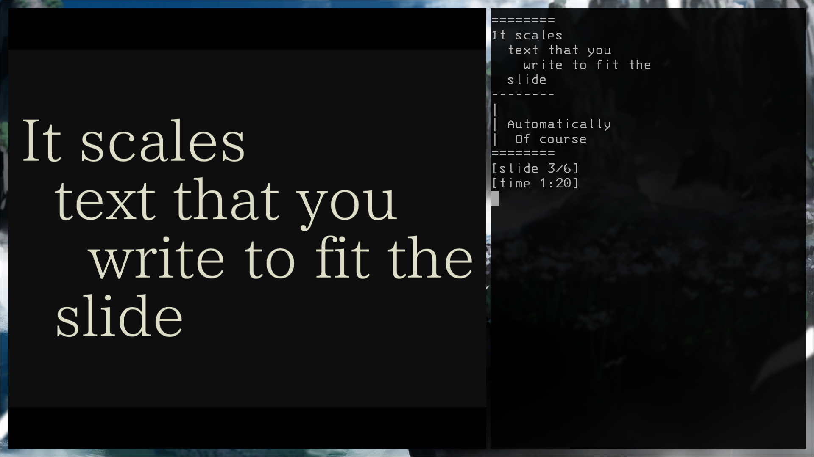

# Reiha レイハ

### Describtion

A tool for creating presentations using a plain text file. Thanks to this, your
presentation content can always be accessed from any device.

It utilises the takahashi method:
https://presentationzen.blogs.com/presentationzen/2005/09/living_large_ta.html

Inspired by ```sent```

Some features borrowed from ```wend```

### How it looks (presentation: left side, terminal output: right side)



### Usage

```reiha <path>```

### Options
```-t, --theme dark|light|<bg_hex>x<font_hex>``` - Set theme
```-l, --linear``` - set texture filtering mode to linear, default is nearest
```-f, --font <font_path>``` - Use a custom font
```-r, --resolution <width>x<height>``` - Set virtual resolution (default 1600x1200) (max 3840x3840)
```-n, --numbering``` - turn on the slide numbering
```-p, --preview``` - shows next slide in your terminal if there is such

### Movement

```
To close reiha you can use:
Esc || Q

To move to next slide you can use:
Arrow Down || Arrow Right || J || L

To move to previous slide you can use:
Arrow UP || Arrow Left || K || H

To enter fullscreen mode you can use:
F11 || F

Turn on/off slide numbering:
N

Turn on/off next slide preview:
P

*Letter case doesn't metter
```

### Config file
Its location can be ```/home/user/.config/reiha/config```.

```
--theme 000011xff4444
--resolution 400x300
--linear
--font /home/user/.fonts/Catholicon.otf
--numbering
--preview
```

Short versions of flags can be used ex. instead ```--numbering``` you'll write ```-n```.

### Syntax:

```
| This is an example syntax
|   - every line that starts with | is considered a comment
|     and only being seen in terminal during presentation
|   - there can be your notes
|   - the first comment block is omitted

レイハ
| The name of the tool
| inspired by sent, wend and takahashi method

@test/screen.png
| To make image slide, start the line with @
|   Blah

| this is comment for you, and it is totally omitted

It scales
  text that you
    write to fit the
  slide
|
| Automatically
|  Of course


| Number of spaces can be any, but there must be one at least


this slide
~
with empty line
| notice the ~ symbol on empty line
| it is not going to be rendered 


\
| Use \ to create an empty slide

    reiha <filename>
one slide per paragraph

questions?
```

### Output to console

```
========
It scales
  text that you
    write to fit the
  slide
--------
|
| Automaticly
|  Of course
========
[slide 3/6]
[time 1:20]
``` 
